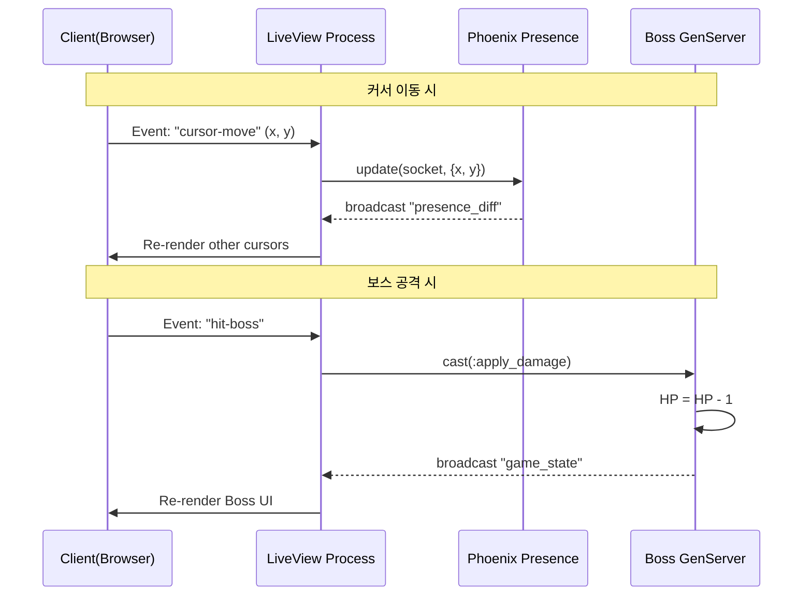

## 2. TRD (Technical Requirements Document)

### 2.1 시스템 아키텍처

- **Framework:** Phoenix Framework 1.7+ (LiveView Native)
- **Language:** Elixir (Erlang OTP / BEAM)
- **Styling:** Tailwind CSS
- **Deployment:** Fly.io (Cluster + Global 배포)

---

### 2.2 핵심 기술 컴포넌트

#### A. LiveView (Rendering Layer)

- **역할:**  
  WebSocket 연결 유지 및 DOM 실시간 업데이트
- **최적화 전략:**
  - `temporary_assigns`: 커서 데이터 누적 방지
  - **Client-side Throttling:**  
    `mousemove` / `touchmove` 이벤트 30~50ms 간격 제한

---

#### B. Phoenix Presence (Cursor Tracking)

- **역할:**  
  분산 환경에서 유저 메타데이터 동기화
- **특징:**
  - CRDT 기반
  - 중앙 DB 없이 메모리 상 최종 일관성 보장
  - 초고속 동기화

---

#### C. GenServer (Game Logic - Boss)

- **이름:** `CursorParty.GameServer`
- **역할:**  
  보스 상태 (HP, Phase) 관리
- **장애 허용:**  
  Supervisor에 의해 자동 재시작  
  → 게임 초기화 또는 상태 복구 가능

---

### 2.3 데이터 흐름도

